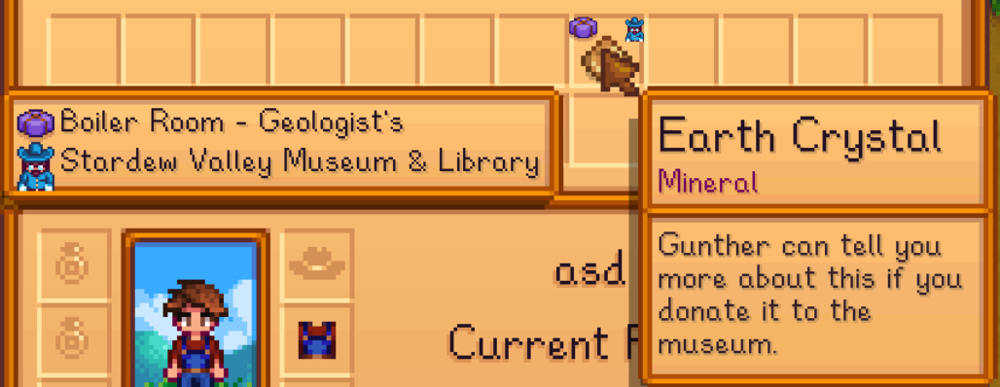
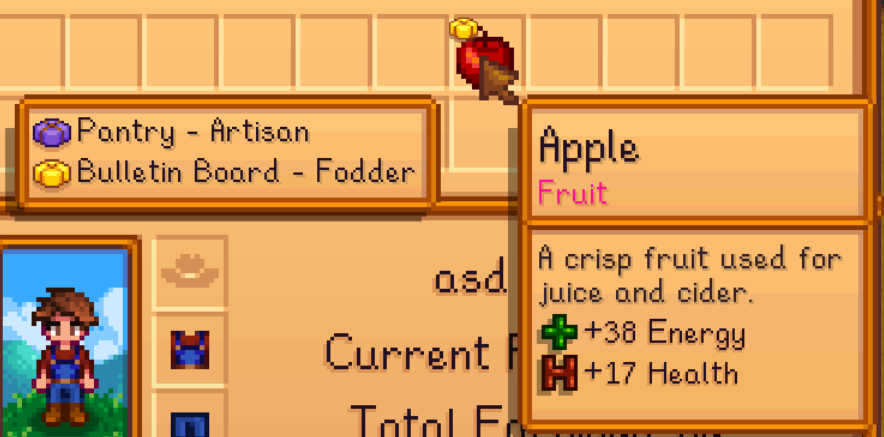
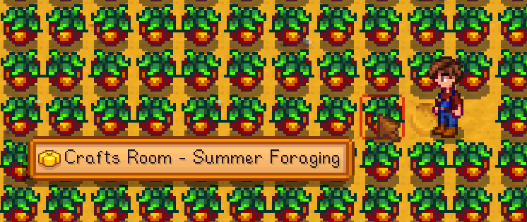
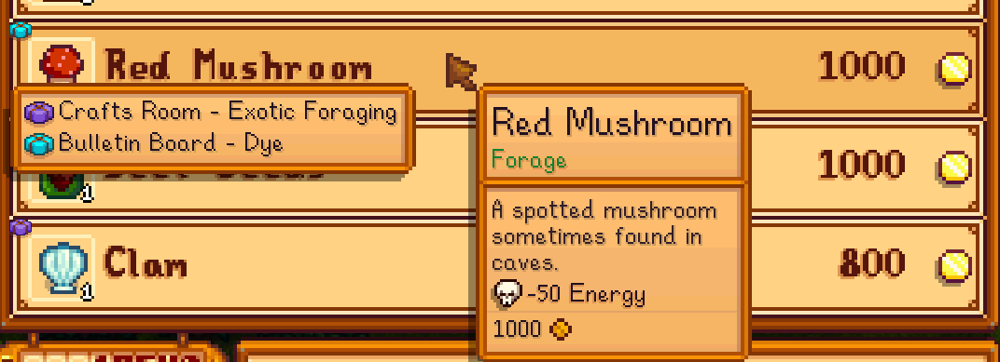
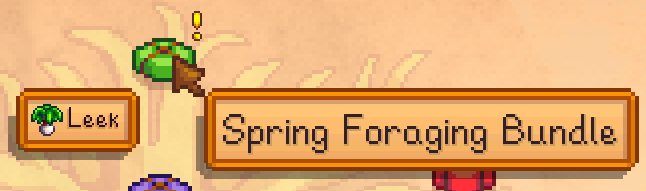

# HaveIDonated
A Stardew Valley [SMAPI](https://smapi.io/) mod, that shows you if you need to donate something to either the Community Center or the Stardew Valley Museum.

## Features
- Add icons and tooltip to inventory items that can be donated.

- ...including items that can be donated to multiple bundles.

    
- Add tooltip to forage items that can be donated.

- Add icons and tooltip to shop items that can be donated.

- Add tooltip to bundles on the Community Center menu that shows items in your inventory that can be donated.

- Press `F1` when hovering an item that can be donated to the Community Center to show its bundle menu.
- Press `F1` when hovering an item that can be donated to the Museum to reveal it in the `collections` menu.
